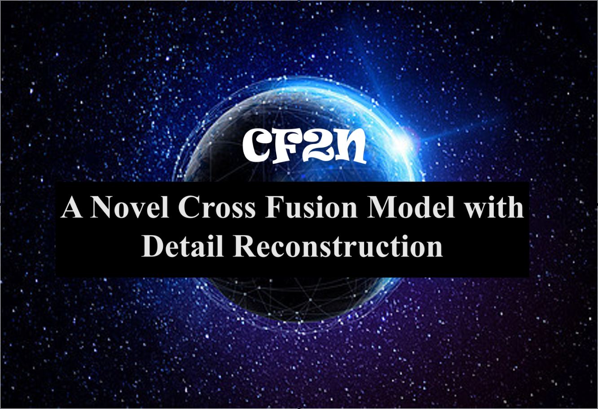
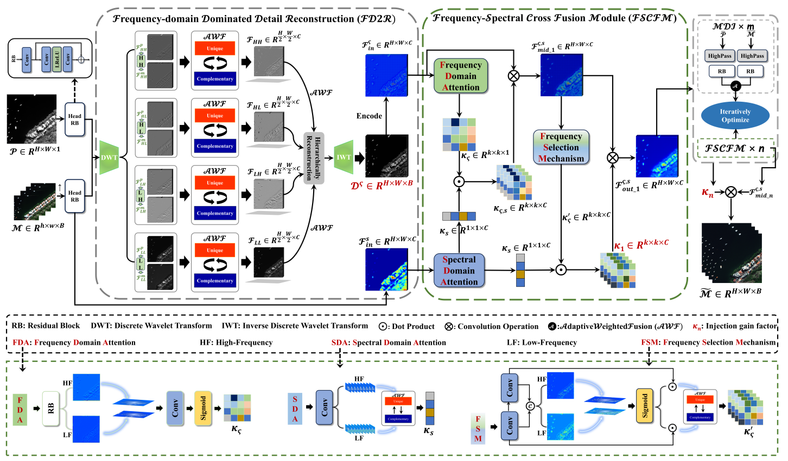
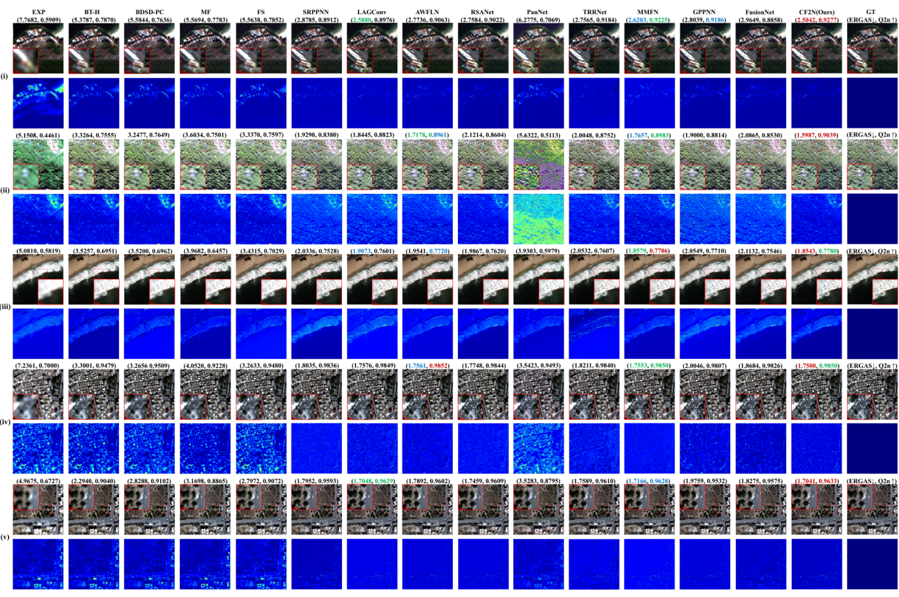
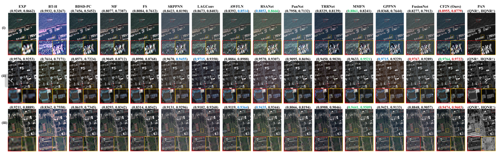
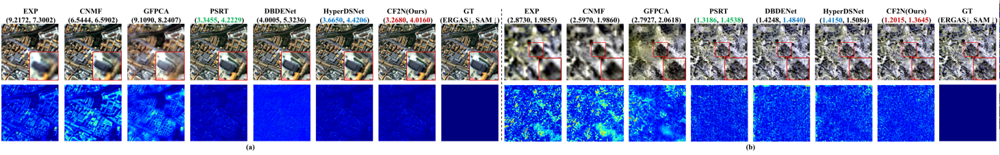
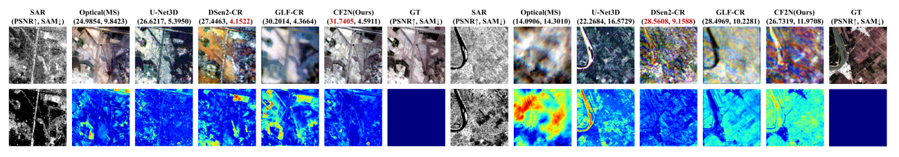
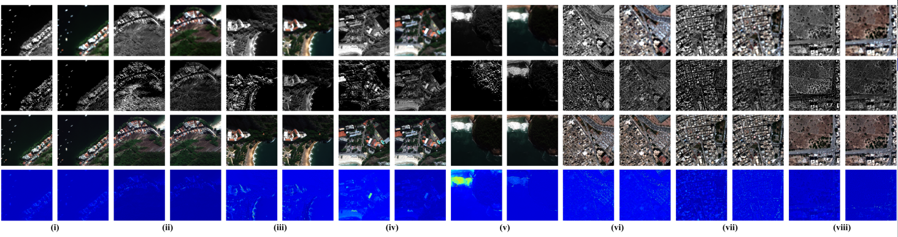

<div align="center">


# **A novel cross fusion model with fine-grained detail reconstruction for remote sensing image pan-sharpening.**

______________________________________________________________________

<p align="center">
<a href="https://www.tandfonline.com/doi/full/10.1080/10095020.2024.2416899">Paper</a> ?
<a href="#Abstract">Abstract</a> ?
<a href="#Method">Method</a> ?
<a href="#Dependencies">Installation</a> ?
<a href="#Dataset">Dataset</a> ?
<a href="#Training">Training</a> ?
<a href="#Testing">Testing</a> ?
<a href="#Pre-trained-models-and-results">Results</a> ?
<a href="#Citation">Citation</a><br>
</p>

[]()
[](https://github.com/JUSTM0VE0N/CF2N/blob/main/LICENSE)

</div>

______________________________________________________________________
### What's New
- **[November 7th, 2024]**: The paper of CF2N is published: [A novel cross fusion model with ffne-grained detail reconstruction for remote sensing image pan-sharpening](https://www.tandfonline.com/doi/full/10.1080/10095020.2024.2416899).
- **[June 19th, 2024]**: The code of CF2N is available.
- **[March 15th, 2024]**: CF2N is first submission!!!


### Abstract
<br>

Pan-sharpening aims to obtain high resolution multispectral (HRMS) images by integrating the information in the panchromatic and multispectral images. Existing pan-sharpening methods have demonstrated impressive sharpening performance. However, these methods inherently overlook the complementary characteristics and interaction between diverse source images, resulting in sharpened outcomes accompanied by distortion. To solve the above problems, we construct a novel cross fusion model with fine-grained detail reconstruction from the perspective of frequency-domain. The motivation of the model is twofold: (1) to reconstruct spatial detail representations from diverse source images, laying the foundation for the generation of fine details in the subsequent fused images; and (2) to enhance the interaction between diverse source features during the fusion process in order to attain high-fidelity fusion outcomes. Based on the theoretical model, we develop a frequency-spectral dual domain cross fusion network (CF2N) utilizing the deep learning technique. Consequently, the CF2N consist of two main stages, namely frequency-domain dominated detail reconstruction (FD2R) and frequency-spectral cross fusion (FSCF). Specifically, a more reasonable reconstruction of fine frequency details in HRMS can be achieved by performing adaptive weighted fusion of frequency details in the FD2R stage. Furthermore, the FSCF module, which seamlessly integrates frequency- and spectral-domain details in a highly interactive cross fusion manner. As a result, the CF2N possesses the capability to attain high frequency-spectral fidelity results with excellent interpretability. Extensive experiments show the superior performance of ours over state of the art, while maintaining high efficiency. All implementations of this work will be published at our website.


### Method
#### The overall framework:
<br>


The flowchart depicting the proposed CF2N, which is guided by the constructed cross fusion model. The CF2N consists of two main stages: FD2R and FSCF.

### Dependencies
Our released implementation is tested on:

- Ubuntu 20.04
- Python 3.7.x 
- PyTorch 1.11 / torchvision 1.11.0
- Tensorboard 1.8
- NVIDIA CUDA 11.3
- 2x NVIDIA GTX 3060

```shell
$ cd CF2N
$ pip install -r requirements.yaml
```

The requirements.yaml I provided contains all the installed libraries for my conda environment. You can only download the libraries needed for this project. In addition, the requirements.yaml might be slight different on different machines. If you can't find a specific version, please try pip install related version first. 


### Dataset
The MS data supporting the findings of this study are available in [PanCollection](https://github.com/liangjiandeng/PanCollection).  

The HS data supporting the findings of this study are available in [HyperPanCollection](https://github.com/liangjiandeng/HyperPanCollection).

The SAR data supporting the findings of this study are available in [SEN2MS-CR](https://patricktum.github.io/cloud_removal/sen12mscr/).  

You can download the corresponding datasets at the link I provided.


### Training
You can easily integrate your methodology into our framework.
```bash
$ cd CF2N
# An example command for training
$ python train.py --option_path option.yml
```

During the training, tensorboard logs are saved under the experiments directory. To run the tensorboard:

```bash
$ cd ./logs/CF2N
$ tensorboard --logdir=. --bind_all
```
The tensorboard visualization includes metric curves and map visualization.


### Testing
With only batch size 1 is recomended. 
```bash
$ cd ./

# An example command for testing
$ python test.py --option_path option.yml
```


### Pre-trained Models and Results
#### ? Pre-trained Models
#### We provide the trained models at [[download link]](https://drive.google.com/drive/folders/1q3s_6VtsNSfYsWbept1VM1KO0-dMVipN?usp=sharing). You can test it directly with our trained weights.

#### ? The Reduced-resolution test results in the multispectral pan-sharpening task. (Taking WorldView-3 as a example)
<br>


#### ? The Full-resolution test results in the multispectral pan-sharpening task. (Taking QuickBird as a example)
<br>


#### ? The results in the hyperspectral pan-sharpening task. 
<br>


#### ? The results in the SAR-optical fusion task. 
<br>


#### ? Visualization of detail representation. 
<br>


Eight examples of detail representation in different methods. The first line shows the original image pairs with the left side being PAN and the right side being MS; the second, third and fourth lines show the detail representations, the fusion results and the corresponding AEMs, respectively, with the left side being FusionNet and the right side being the proposed CF2N.

#### We provide all test results at [[download link]](https://drive.google.com/drive/folders/127dBrqi6XgTgJIzhwBQC-4TNpwvff5Gc?usp=sharing).


### Citation
This paper is published in GSIS 2024.

```
@article{doi:10.1080/10095020.2024.2416899,
author = {Chuang Liu, Zhiqi Zhang, Mi Wang, Shao Xiang and Guangqi Xie},
title = {A novel cross fusion model with fine-grained detail reconstruction for remote sensing image pan-sharpening},
journal = {Geo-spatial Information Science},
volume = {0},
number = {0},
pages = {1-29},
year = {2024},
publisher = {Taylor & Francis},
doi = {10.1080/10095020.2024.2416899},
URL = {https://doi.org/10.1080/10095020.2024.2416899},
eprint = {https://doi.org/10.1080/10095020.2024.2416899}
}
```

### Contact
We are glad to hear from you. If you have any questions, please feel free to contact us.
